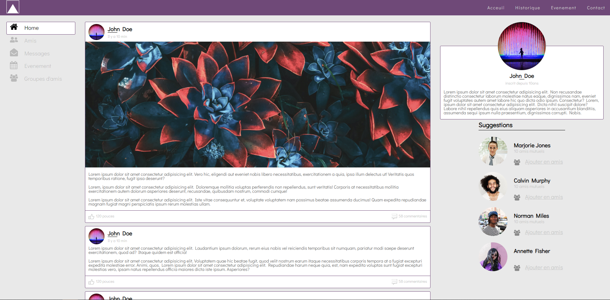
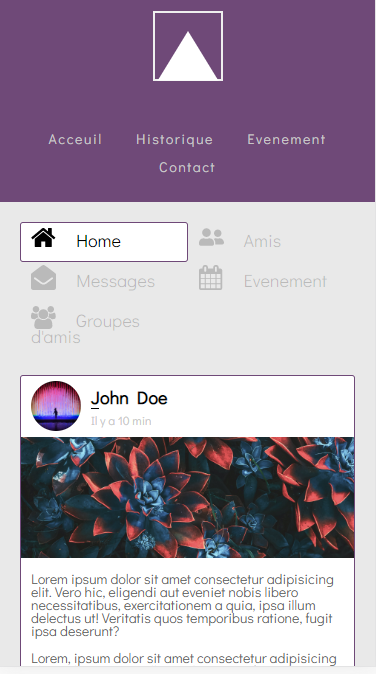

# Template-Social-Network

[Template-Social-Network](file:///C:/Users/Work/Documents/GitHub/Template-Social-Network/index.html) is a social network theme responsive inspired by a tutorial of [Grafikart](https://www.grafikart.fr/) for mastering HTML/CSS. This theme contains multiples sections like a navbar, a main with posts of images and texts, a content aside with card profile and friends suggestions.

## Preview

Desktop version:

Mobile version:

## Download and Installation

Download the project, choose one of the following options:

- Clone the repo: `git clone https://github.com/fdebrabant/Template-Social-Network.git`
- Simply [download](https://github.com/fdebrabant/Template-Social-Network/archive/master.zip) the project as zip file.

Then open the index.html in your browser.

## Usage

### Basic Usage

After downloading, simply edit the HTML and CSS files included with the template in your favorite text editor to make changes. These are the only files you need to worry about, you can ignore everything else! To preview the changes you make to the code, you can open the `index.html` file in your web browser.

### Mockup

For this template I made a [Mockup](https://www.figma.com/file/c2rwo5vYBGSFBj3L2euaD2/Untitled?node-id=0%3A1) with [Figma](https://www.figma.com/), the collaborative interface design tool.

## About

This template is inspired by Grafikart's tutorial, check it [here](https://www.grafikart.fr/tutoriels/tp-reseau-social-1051).